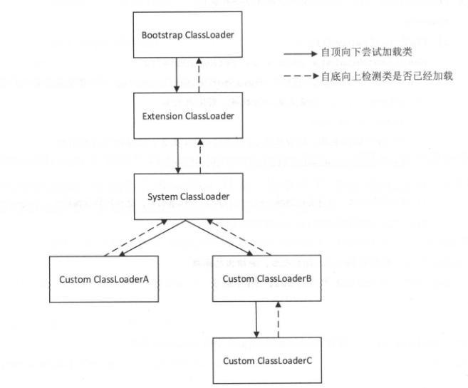

## java类加载机制

> java中的类加载器负载加载来自文件系统、网络或者其他来源的类文件， jvm的类加载器默认使用的是双亲委派模式。
> 三种默认的类加载器Bootstrap ClassLoader、Extension ClassLoader和System ClassLoader（Application ClassLoader）每一个中类加载器都确定了从哪一些位置加载文件。
> 与此同时我们也可以通过继承java.lang.classloader实现自己的类加载器。

* Bootstrap ClassLoader(`BootstrapClassLoader`)：负责加载JDK自带的rt.jar包中的类文件，是所有类加载的父类
* Extension ClassLoader(`ExtClassLoader`)：负责加载java的扩展类库从jre/lib/ect目录或者java.ext.dirs系统属性指定的目录下加载类，是System ClassLoader的父类加载器
* System ClassLoader(`AppClassLoader`)：负责从classpath环境变量中加载类文件



* 双亲委派模型

    * 原理：
    > 当一个类加载器收到类加载任务时，会先交给自己的父加载器去完成，因此最终加载任务都会传递到最顶层的BootstrapClassLoader，只有当父加载器无法完成加载任务时，才会尝试自己来加载。

    * 优势
    > 采用双亲委派模式可以保证类型加载的安全性，不管是哪个加载器加载这个类，最终都是委托给顶层的BootstrapClassLoader来加载的，只有父类无法加载自己才尝试加载，
    > 这样就可以保证任何的类加载器最终得到的都是同样一个Object对象。

    ```java
    public abstract class ClassLoader {
    
    
        /**
         * Loads the class with the specified <a href="#name">binary name</a>.
         * This method searches for classes in the same manner as the {@link
         * #loadClass(String, boolean)} method.  It is invoked by the Java virtual
         * machine to resolve class references.  Invoking this method is equivalent
         * to invoking {@link #loadClass(String, boolean) <tt>loadClass(name,
         * false)</tt>}.
         *
         * @param  name
         *         The <a href="#name">binary name</a> of the class
         *
         * @return  The resulting <tt>Class</tt> object
         *
         * @throws  ClassNotFoundException
         *          If the class was not found
         */
        public Class<?> loadClass(String name) throws ClassNotFoundException {
            return loadClass(name, false);
        }
    
        /**
         * Loads the class with the specified <a href="#name">binary name</a>.  The
         * default implementation of this method searches for classes in the
         * following order:
         *
         * <ol>
         *
         *   <li><p> Invoke {@link #findLoadedClass(String)} to check if the class
         *   has already been loaded.  </p></li>
         *
         *   <li><p> Invoke the {@link #loadClass(String) <tt>loadClass</tt>} method
         *   on the parent class loader.  If the parent is <tt>null</tt> the class
         *   loader built-in to the virtual machine is used, instead.  </p></li>
         *
         *   <li><p> Invoke the {@link #findClass(String)} method to find the
         *   class.  </p></li>
         *
         * </ol>
         *
         * <p> If the class was found using the above steps, and the
         * <tt>resolve</tt> flag is true, this method will then invoke the {@link
         * #resolveClass(Class)} method on the resulting <tt>Class</tt> object.
         *
         * <p> Subclasses of <tt>ClassLoader</tt> are encouraged to override {@link
         * #findClass(String)}, rather than this method.  </p>
         *
         * <p> Unless overridden, this method synchronizes on the result of
         * {@link #getClassLoadingLock <tt>getClassLoadingLock</tt>} method
         * during the entire class loading process.
         *
         * @param  name
         *         The <a href="#name">binary name</a> of the class
         *
         * @param  resolve
         *         If <tt>true</tt> then resolve the class
         *
         * @return  The resulting <tt>Class</tt> object
         *
         * @throws  ClassNotFoundException
         *          If the class could not be found
         */
        protected Class<?> loadClass(String name, boolean resolve)
            throws ClassNotFoundException
        {
            synchronized (getClassLoadingLock(name)) {
                // First, check if the class has already been loaded
                // 首先，检查该类是否已经被加载，如果从JVM缓存中找到该类，则直接返回
                Class<?> c = findLoadedClass(name);
                if (c == null) {
                    long t0 = System.nanoTime();
                    try {
                        // 遵循双亲委派的模型，首先会通过递归从父加载器开始找，
                        // 直到父类加载器是BootstrapClassLoader为止
                        if (parent != null) {
                            c = parent.loadClass(name, false);
                        } else {
                            c = findBootstrapClassOrNull(name);
                        }
                    } catch (ClassNotFoundException e) {
                        // ClassNotFoundException thrown if class not found
                        // from the non-null parent class loader
                    }
    
                    if (c == null) {
                        // If still not found, then invoke findClass in order
                        // to find the class.
    
                        // 如果还找不到，尝试通过findClass方法去寻找
                        // findClass是留给开发者自己实现的，也就是说
                        // 自定义类加载器时，重写此方法即可
                        long t1 = System.nanoTime();
                        c = findClass(name);
    
                        // this is the defining class loader; record the stats
                        sun.misc.PerfCounter.getParentDelegationTime().addTime(t1 - t0);
                        sun.misc.PerfCounter.getFindClassTime().addElapsedTimeFrom(t1);
                        sun.misc.PerfCounter.getFindClasses().increment();
                    }
                }
                if (resolve) {
                    resolveClass(c);
                }
                return c;
            }
        }
    
        // ...
    
    
    }
    ```

   * 存在的问题
   > Java SPI (Service Provider Interface) 允许第三方为这些接口提供实现，常见的 SPI 有 JDBC, JNDI等等，接口由核心类库提供，交给第三方实现

   > 问题: SPI 的接口是 Java 核心库的一部分，是由BootstrapClassLoader加载的；SPI实现的Java类一般是由AppClassLoader来加载的。
   > BootstrapClassLoader是无法找到 SPI 的实现类的，因为它只加载Java的核心库。它也不能代理给AppClassLoader，因为它是最顶层的类加载器。
   > 也就是说，双亲委派模型并不能解决这个问题。                                                                                                                                                                                                                                                                                                                                                                                                                                                                                                                                                                                                                                                                                                                                                                                                                                                                                                                                                                                                                                                                                                                                                                                                                                                                                                                                                                                                                                                                                                                                                                                                                                                                                                                                                                                                                                                                                                                                                                                                                                                                                                                                                                                                                                                                                                                                                                                                                                                                                                                                                                                                                                                                                                                                                                                                                                                                                                                                                                                                                                                                                                                                                                                                                                                                                                                                                                                                                                                                                                                                                                                                                                                                                                                                                                                                                                                                                                                                                                                                                                                                                                                                                                                                                                                                                                                                                                                                                                                                                                                                                                                                                                                                                                                                                                                                                                                                                                                                                                                                                                                                                                                                                              
   
   * JDBC驱动管理java.sql.Driver中的loadInitialDrivers()        
                                                                                                                                                                                                                                                                                                                                                                                                                                                                                                                                                                                                                                                                                                                                                                                                                                                                                                                                                                                                                                                                                                                                                                                                                                                                                                                                                                                                                                                                                                                                                                                                                                                                                                                                                                                                                                                                                                                                                                                                                                                                                                                                                                                                                                                                                                                                                                                                                                                                                                                                                                                                                                                                                                                                                                                                                                                                                                                                                                                                                                                                                                                                                                                                                                                                                                                                                                                                                                                                                                                                                                                                                                                                                                                                                                                                                                                                                                                                                                                                                                                                                                                                                                                                                                                                                                                                                                                                                                                                                                                                                                                                                                                                                                                                                                                                                                                                                                                                                                                                                                                                                                                                                                          
    ```java
        for (String aDriver : driversList) {
            try {
                // 直接使用AppClassLoader
                Class.forName(aDriver, true, ClassLoader.getSystemClassLoader());
            } catch (Exception ex) {
                println("DriverManager.Initialize: load failed: " + ex);
            }
        }
    ```
  
    * 类加载器加载 jar包 中的资源 `ClassLoader.getResources(String name)`
    
    ```java
          public Enumeration<URL> getResources(String name) throws IOException {
              Enumeration<URL>[] tmp = (Enumeration<URL>[]) new Enumeration<?>[2];
              if (parent != null) {
                  tmp[0] = parent.getResources(name);
              } else {
                  tmp[0] = getBootstrapResources(name);
              }
              tmp[1] = findResources(name);
              return new CompoundEnumeration<>(tmp);
          }
    ```
    
    * 类加载器的`findResources(name)`方法会遍历其负责加载的所有jar包，找到jar包中名称为name的资源文件，这里的资源可以是任何文件，甚至是`.class`文件

    ```java
        // 寻找Array.class文件
        public static void main(String[] args) throws Exception{
            // Array.class的完整路径
            String name = "java/sql/Array.class";
            Enumeration<URL> urls = Thread.currentThread().getContextClassLoader().getResources(name);
            while (urls.hasMoreElements()) {
                URL url = urls.nextElement();
                System.out.println(url.toString());
            }
        }
    ```