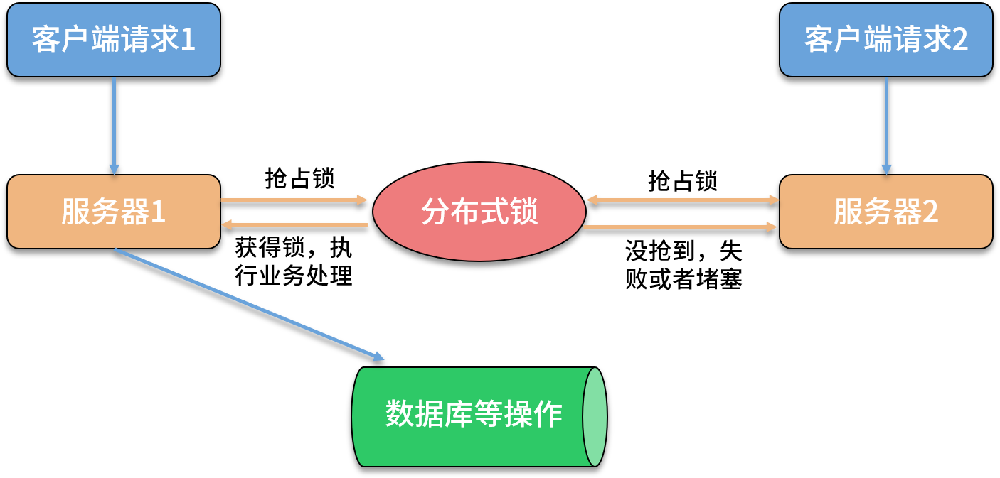

## 分布式锁



分布式锁的目的是保证在分布式部署的应用集群中，多个服务在请求同一个方法或者同一个业务操作的情况下，对应业务逻辑只能被一台机器上的一个线程执行，避免出现并发问题。

## 完备的分布式锁特性

* `互斥性`，互斥是锁的基本特征，同一时刻只能有一个线程持有锁，执行临界操作；
* `超时释放`，超时释放是锁的另一个必备特性，可以对比 MySQL InnoDB 引擎中的 innodb_lock_wait_timeout 配置，通过超时释放，防止不必要的线程等待和资源浪费；
* `可重入性`，在分布式环境下，同一个节点上的同一个线程如果获取了锁之后，再次请求还是可以成功；
* `高性能和高可用`，加锁和解锁的开销要尽可能的小，同时也需要保证高可用，防止分布式锁失效；
* `支持阻塞和非阻塞性`，对比 Java 语言中的 wait() 和 notify() 等操作，这个一般是在业务代码中实现，比如在获取锁时通过 while(true) 或者轮询来实现阻塞操作。


## 分布式锁的常用实现

> 实现分布式锁目前有三种流行方案，即基于数据库、Redis、ZooKeeper 的方案。


### 基于关系型数据库

TODO

### 基于 Redis

#### Redis 分布式锁的几种实现方式

##### setnx

> Redis 支持 setnx 指令，只在 key 不存在的情况下，将 key 的值设置为 value，若 key 已经存在，则 setnx 命令不做任何动作。
> 使用 setnx 实现分布式锁的方案，获取锁的方法很简单，只要以该锁为 key，设置一个随机的值即可。
> 如果 setnx 返回 1，则说明该进程获得锁；如果 setnx 返回 0，则说明其他进程已经获得了锁，进程不能进入临界区；
>  如果需要阻塞当前进程，可以在一个循环中不断尝试 setnx 操作。

```
if(setnx(key,value)==1){
     try{
        //业务处理
     }finally{
       //释放锁
       del(key)
     }
}
```

* 问题： 不支持超时释放锁，如果进程在加锁后宕机，则会导致锁无法删除，其他进程无法获得锁。

##### setnx 和 expire 

```
if(setnx(key,value)==1){
     expire(key,expireTime)
     try{
        //业务处理
     }finally{
       //释放锁
       del(key)
     }
}
```

* 问题：setnx 和 expire 这两条命令不具备原子性。如果一个线程在执行完 setnx 之后突然崩溃，导致锁没有设置过期时间，那么这个锁就会一直存在，无法被其他线程获取。

##### set 扩展命令

```
redis> SET key value expireTime nx
```

#### 分布式锁高可用

##### 集群下的分布式锁问题

> 集群环境下，Redis 通过主从复制来实现数据同步，Redis 的主从复制（Replication）是异步的，所以单节点下可用的方案在集群的环境中可能会出现问题，在故障转移（Failover） 过程中丧失锁的安全性。

##### Redlock 算法的流程

> Redlock 算法是在单 Redis 节点基础上引入的高可用模式，Redlock 基于 N 个完全独立的 Redis 节点，一般是大于 3 的奇数个（通常情况下 N 可以设置为 5），可以基本保证集群内各个节点不会同时宕机。
>

> 假设当前集群有 5 个节点，运行 Redlock 算法的客户端依次执行下面各个步骤，来完成获取锁的操作：

> * 客户端记录当前系统时间，以毫秒为单位；
> * 依次尝试从 5 个 Redis 实例中，使用相同的 key 获取锁，当向 Redis 请求获取锁时，客户端应该设置一个网络连接和响应超时时间，超时时间应该小于锁的失效时间，避免因为网络故障出现的问题；
> * 客户端使用当前时间减去开始获取锁时间就得到了获取锁使用的时间，当且仅当从半数以上的 Redis 节点获取到锁，并且当使用的时间小于锁失效时间时，锁才算获取成功；
> * 如果获取到了锁，key 的真正有效时间等于有效时间减去获取锁所使用的时间，减少超时的几率；
> * 如果获取锁失败，客户端应该在所有的 Redis 实例上进行解锁，即使是上一步操作请求失败的节点，防止因为服务端响应消息丢失，但是实际数据添加成功导致的不一致。
>
> [Redission Wiki](https://github.com/redisson/redisson/wiki/%E7%9B%AE%E5%BD%95)


#### Redis分布式锁的实现案例

> [Redis分布式锁的实现案例](https://github.com/fxbin/bubble-fireworks/tree/master/bubble-fireworks-project/bubble-fireworks-plugins/bubble-fireworks-plugin-lock)


### 基于 ZooKeeper 实现

> ZooKeeper 有四种节点类型，包括持久节点、持久顺序节点、临时节点和临时顺序节点，利用 ZooKeeper 支持临时顺序节点的特性，可以实现分布式锁。

> 当客户端对某个方法加锁时，在 ZooKeeper 中该方法对应的指定节点目录下，生成一个唯一的临时有序节点
> 
> 
> 判断是否获取锁，只需要判断持有的节点是否是有序节点中序号最小的一个，当释放锁的时候，将这个临时节点删除即可，这种方式可以避免服务宕机导致的锁无法释放而产生的死锁问题。

#### ZooKeeper 实现分布式锁的算法流程

> 根节点为 /lock

* 客户端连接 ZooKeeper，并在 /lock 下创建临时有序子节点，第一个客户端对应的子节点为 /lock/lock01/00000001，第二个为 /lock/lock01/00000002；
* 其他客户端获取 /lock01 下的子节点列表，判断自己创建的子节点是否为当前列表中序号最小的子节点；
* 如果是则认为获得锁，执行业务代码，否则通过 watch 事件监听 /lock01 的子节点变更消息，获得变更通知后重复此步骤直至获得锁；
* 完成业务流程后，删除对应的子节点，释放分布式锁。

#### ZooKeeper 分布式锁的实现案例

TODO