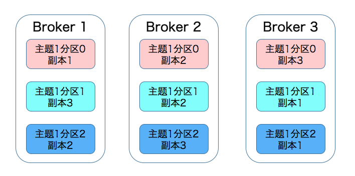

## Apache Kafka 副本机制

### 副本机制

> 所谓的副本机制（Replication），也可以称之为备份机制，通常是指分布式系统在多台网络互联的机器上保存有相同的数据拷贝

### 副本机制好处

* 提供数据冗余
    > 即使系统部分组件失效，系统依然能够继续运转，因而增加了整体可用性以及数据持久性
* 提供高伸缩性
    > 支持横向扩展，能够通过增加机器的方式来提升读性能，进而提高读操作吞吐量
* 改善数据局部性
    > 允许将数据放入与用户地理位置相近的地方，从而降低系统延时

### 副本概念

> 所谓副本（Replica），本质就是一个只能追加写消息的提交日志
> 根据 Kafka 副本机制的定义，同一个分区下的所有副本保存有相同的消息序列，这些副本分散保存在不同的 Broker 上，从而能够对抗部分 Broker 宕机带来的数据不可用。
> 

### 副本角色

基于领导者（Leader-based）的副本机制

