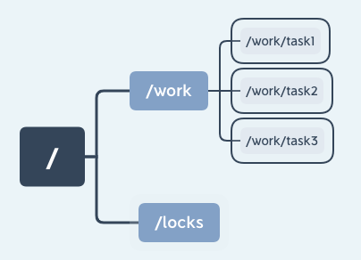
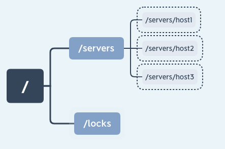
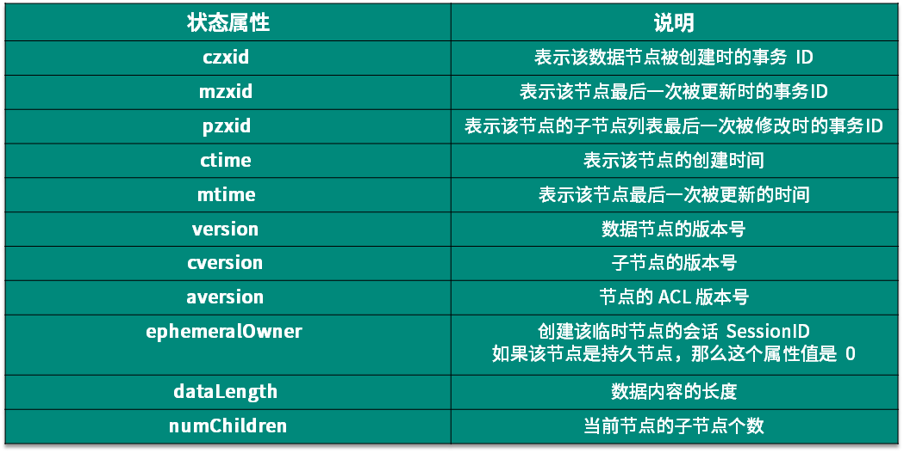

## 数据模型

> ZooKeeper 中的数据模型是一种树形结构，非常像电脑中的文件系统，有一个根文件夹，下面还有很多子文件夹。
> ZooKeeper 的数据模型也具有一个固定的根节点（/），我们可以在根节点下创建子节点，并在子节点下继续创建下一级节点。
> ZooKeeper 树中的每一层级用斜杠（/）分隔开，且只能用绝对路径（如“get /work/task1”）的方式查询 ZooKeeper 节点，而不能使用相对路径
> 如下图所示：
> 
>

## znode 节点类型与特性

> ZooKeeper 中的数据节点分为持久节点、临时节点和有序节点三种类型

### 持久节点

> 一旦将节点创建为持久节点，该数据节点会一直存储在 ZooKeeper 服务器上，即使创建该节点的客户端与服务端的会话关闭了，
> 该节点依然不会被删除。如果我们想删除持久节点，就要显式调用 delete 函数进行删除操作。

### 临时节点

> 如果将节点创建为临时节点，那么该节点数据不会一直存储在 ZooKeeper 服务器上。当创建该临时节点的客户端会话因超时或发生
> 异常而关闭时，该节点也相应在 ZooKeeper 服务器上被删除。同样，我们可以像删除持久节点一样主动删除临时节点。
> 临时节点不允许有子节点，所以其子节点字段为 null
>
> 我们可以利用临时节点的这一特性来做服务器集群内机器运行情况的统计，将集群设置为“/servers”节点，并为集群下的每台服务器创建一个临时节点“/servers/host”，
> 当服务器下线时该节点自动被删除，最后统计临时节点个数就可以知道集群中的运行情况。如下图所示：
> 

### 有序节点

> 有序节点并不算是一种单独种类的节点，而是在之前提到的持久节点和临时节点特性的基础上，增加了一个节点有序的性质。
> 所谓节点有序是说在我们创建有序节点的时候，ZooKeeper 服务器会自动使用一个单调递增的数字作为后缀，追加到我们创建节点的后边。
>
> 例如一个客户端创建了一个路径为 works/task- 的有序节点，那么 ZooKeeper 将会生成一个序号并追加到该节点的路径后，最后该节点的路径为 works/task-1。
> 通过这种方式我们可以直观的查看到节点的创建顺序。

## 节点的状态结构

```shell script
stat /数据节点
```

```shell script
cZxid = 0x16
ctime = Thu Sep 03 05:53:49 UTC 2020
mZxid = 0x16
mtime = Thu Sep 03 05:53:49 UTC 2020
pZxid = 0x17
cversion = 1
dataVersion = 0
aclVersion = 0
ephemeralOwner = 0x0
dataLength = 0
numChildren = 1
```




## 数据节点的版本

> 每个数据节点有 3 种类型的版本信息，对数据节点的任何更新操作都会引起版本号的变化。
> ZooKeeper 的版本信息表示的是对节点数据内容、子节点信息或者是 ACL 信息的修改次数。


## 使用 ZooKeeper 实现锁

### 悲观锁

Zookeeper悲观锁实现（简）：

* 进程A创建`/locks`临时节点，成功获取锁
* 进程B尝试创建`/locks`节点获取锁，A已经创建，B失败无法获取到锁
* 如果进程A异常中断，在服务器端添加监听事件来通知其他进程重新获取锁。

### 乐观锁

> 乐观锁基本可以分为读取、校验、写入三个步骤。`CAS（Compare-And-Swap）`,即比较并替换，就是一个乐观锁的的实现，
> CAS 有 3 个操作数，内存值 V，旧的预期值 A，要修改的新值 B。当且仅当预期值 A 和内存值 V 相同时，将内存值 V 修改为 B，否则什么都不做。

Zookeeper乐观锁实现步骤：

* 进程A试图进行更新操作，会携带上次获取到的version值进行更新
* 如果在此期间内，Zookeeper 服务器上该节点已经被其它客户端更新，那么数据版本会发送改变，进程A 携带版本号无法匹配，则无法更新成功
