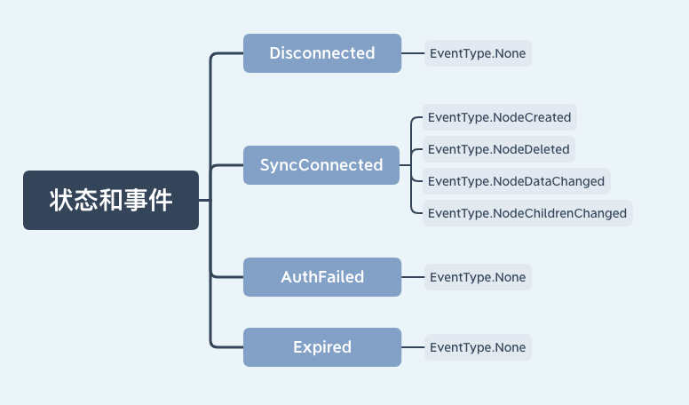
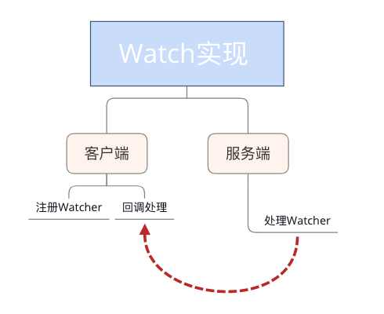

## Watch 机制是如何实现的

* 定义一个客户端对象实例
```
new ZooKeeper(String connectString, int sessionTimeout, Watcher watcher)

connectString 服务端地址
sessionTimeout：超时时间
Watcher：监控事件
```
> 这个 Watcher 将作为整个 ZooKeeper 会话期间的上下文 ，一直被保存在客户端 ZKWatchManager 的 defaultWatcher 中。

* ZooKeeper 客户端也可以通过 getData、exists 和 getChildren 三个接口来向 ZooKeeper 服务器注册 Watcher，从而方便地在不同的情况下添加 Watch 事件：
```
getData(String path, Watcher watcher, Stat stat)
```



## Watch机制的底层实现原理



* ZooKeeper 会在客户端和服务端分别实现两个存放观察者列表，即：ZKWatchManager 和 WatchManager

### 客户端 Watch 注册实现过程

Watch监控事件的会话请求（两件事）：
* 标记该会话是一个带有 Watch 事件的请求
* 将 Watch 事件存储到 ZKWatchManager

以 getData 接口为例
> 当发送一个带有 Watch 事件的请求时，客户端首先会把该会话标记为带有 Watch 监控的事件请求，
> 之后通过 DataWatchRegistration 类来保存 watcher 事件和节点的对应关系：
>
> ```java_holder_method_tree
> public byte[] getData(final String path, Watcher watcher, Stat stat){
>   ...
>   WatchRegistration wcb = null;
>   if (watcher != null) {
>     wcb = new DataWatchRegistration(watcher, clientPath);
>   }
>   RequestHeader h = new RequestHeader();
>   request.setWatch(watcher != null);
>   ...
>   GetDataResponse response = new GetDataResponse();
>   ReplyHeader r = cnxn.submitRequest(h, request, response, wcb);
>   }
> ```
> 之后客户端向服务器发送请求时，是将请求封装成一个 Packet 对象，并添加到一个等待发送队列 outgoingQueue 中：
> ```java_holder_method_tree
> public Packet queuePacket(RequestHeader h, ReplyHeader r，...) {
>     Packet packet = null;
>     ...
>     packet = new Packet(h, r, request, response, watchRegistration);
>     ...
>     outgoingQueue.add(packet); 
>     ...
>     return packet;
> }
> 
> ```
> 最后，ZooKeeper 客户端就会向服务器端发送这个请求，完成请求发送后。调用负责处理服务器响应的 SendThread 线程类中的 readResponse 方法接收服务端的回调，
> 并在最后执行 finishPacket（）方法将 Watch 注册到 ZKWatchManager 中：
>
>```java_holder_method_tree
>private void finishPacket(Packet p) {
>         int err = p.replyHeader.getErr();
>         if (p.watchRegistration != null) {
>             p.watchRegistration.register(err);
>         }
>        ...
> }
>
>```
>
### 服务端 Watch 注册实现过程

Zookeeper 服务端处理 Watch 事件基本有 2 个过程：

* 解析收到的请求是否带有 Watch 注册事件
* 将对应的 Watch 事件存储到 WatchManager

详情如下
> 当 ZooKeeper 服务器接收到一个客户端请求后，首先会对请求进行解析，判断该请求是否包含 Watch 事件。
> 这在 ZooKeeper 底层是通过 FinalRequestProcessor 类中的 processRequest 函数实现的。
> 当 getDataRequest.getWatch() 值为 True 时，表明该请求需要进行 Watch 监控注册。
> 并通过 zks.getZKDatabase().getData 函数将 Watch 事件注册到服务端的 WatchManager 中。
>
> ```java_holder_method_tree
>  public void processRequest(Request request) {
>    ...
>    byte b[] =                zks.getZKDatabase().getData(getDataRequest.getPath(), stat,
>            getDataRequest.getWatch() ? cnxn : null);
>    rsp = new GetDataResponse(b, stat);
>    ..
>    }
> 
> ```

### 服务端 Watch 事件的触发过程

以setData 接口 “节点数据内容发生变更” 事件为例

> 在 setData 方法内部执行完对节点数据的变更后，会调用 WatchManager.triggerWatch 方法触发数据变更事件。

```java_holder_method_tree
    public Stat setData(String path, byte data[], ...){
        Stat s = new Stat();
        DataNode n = nodes.get(path);
        ...
        dataWatches.triggerWatch(path, EventType.NodeDataChanged);
        return s;
    }

```

> triggerWatch 函数
> 封装了一个具有会话状态、事件类型、数据节点 3 种属性的 WatchedEvent 对象, 之后查询该节点注册的 Watch 事件，如果为空说明该节点没有注册过 Watch 事件。如果存在 Watch 事件则添加到定义的 Wathcers 集合中，
> 并在 WatchManager 管理中删除。最后，通过调用 process 方法向客户端发送通知。
```java_holder_method_tree
 Set<Watcher> triggerWatch(String path, EventType type...) {
        WatchedEvent e = new WatchedEvent(type,
                KeeperState.SyncConnected, path);
        Set<Watcher> watchers;
        synchronized (this) {
            watchers = watchTable.remove(path);
            ...
            for (Watcher w : watchers) {
                Set<String> paths = watch2Paths.get(w);
                if (paths != null) {
                    paths.remove(path);
                }
            }
        }
        for (Watcher w : watchers) {
            if (supress != null && supress.contains(w)) {
                continue;
            }
            w.process(e);
        }
        return watchers;
    }
```

### 客户端回调的处理过程

> 客户端使用 SendThread.readResponse() 方法来统一处理服务端的相应。首先反序列化服务器发送请求头信息 replyHdr.deserialize(bbia, "header")，并判断相属性字段 xid 的值为 -1，表示该请求响应为通知类型。
> 在处理通知类型时，首先将己收到的字节流反序列化转换成 WatcherEvent 对象。接着判断客户端是否配置了 chrootPath 属性，如果为 True 说明客户端配置了 chrootPath 属性。
> 需要对接收到的节点路径进行 chrootPath 处理。最后调用 eventThread.queueEvent( ）方法将接收到的事件交给 EventThread 线程进行处理
>
```java_holder_method_tree
if (replyHdr.getXid() == -1) {
    ...
    WatcherEvent event = new WatcherEvent();
    event.deserialize(bbia, "response");
    ...
    if (chrootPath != null) {
        String serverPath = event.getPath();
        if(serverPath.compareTo(chrootPath)==0)
            event.setPath("/");
            ...
            event.setPath(serverPath.substring(chrootPath.length()));
            ...
    }
    WatchedEvent we = new WatchedEvent(event);
    ...
    eventThread.queueEvent( we );
}

```

> EventThread.queueEvent() 方法内部的执行逻辑
>
> 按照通知的事件类型，从 ZKWatchManager 中查询注册过的客户端 Watch 信息。客户端在查询到对应的 Watch 信息后，会将其从 ZKWatchManager 的管理中删除。
> `客户端的 Watcher 机制是一次性的，触发后就会被删除`

```java_holder_method_tree
public Set<Watcher> materialize(...)
{
	Set<Watcher> result = new HashSet<Watcher>();
	...
	switch (type) {
    ...
	case NodeDataChanged:
	case NodeCreated:
	    synchronized (dataWatches) {
	        addTo(dataWatches.remove(clientPath), result);
	    }
	    synchronized (existWatches) {
	        addTo(existWatches.remove(clientPath), result);
	    }
	    break;
    ....
	}
	return result;
}

```

> 将查询到的 Watcher 存储到 waitingEvents 队列中，调用 EventThread 类中的 run 方法会循环取出在 waitingEvents 队列中等待的 Watcher 事件进行处理。

```java_holder_method_tree
public void run() {
	try {
	  isRunning = true;
	  while (true) {
	     Object event = waitingEvents.take();
	     if (event == eventOfDeath) {
	        wasKilled = true;
	     } else {
	        processEvent(event);
	     }
	     if (wasKilled)
	        synchronized (waitingEvents) {
	           if (waitingEvents.isEmpty()) {
	              isRunning = false;
	              break;
	           }
	        }
	  }
     ...
}
```

> 最后调用 processEvent(event) 方法来最终执行实现了 Watcher 接口的 process（）方法。

```java_holder_method_tree
private void processEvent(Object event) {
  ...
  if (event instanceof WatcherSetEventPair) {
      
      WatcherSetEventPair pair = (WatcherSetEventPair) event;
      for (Watcher watcher : pair.watchers) {
          try {
              watcher.process(pair.event);
          } catch (Throwable t) {
              LOG.error("Error while calling watcher ", t);
          }
      }
  }
}

```